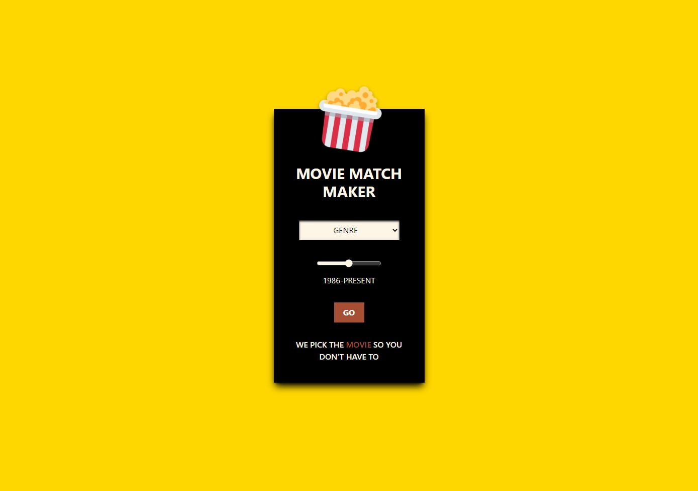
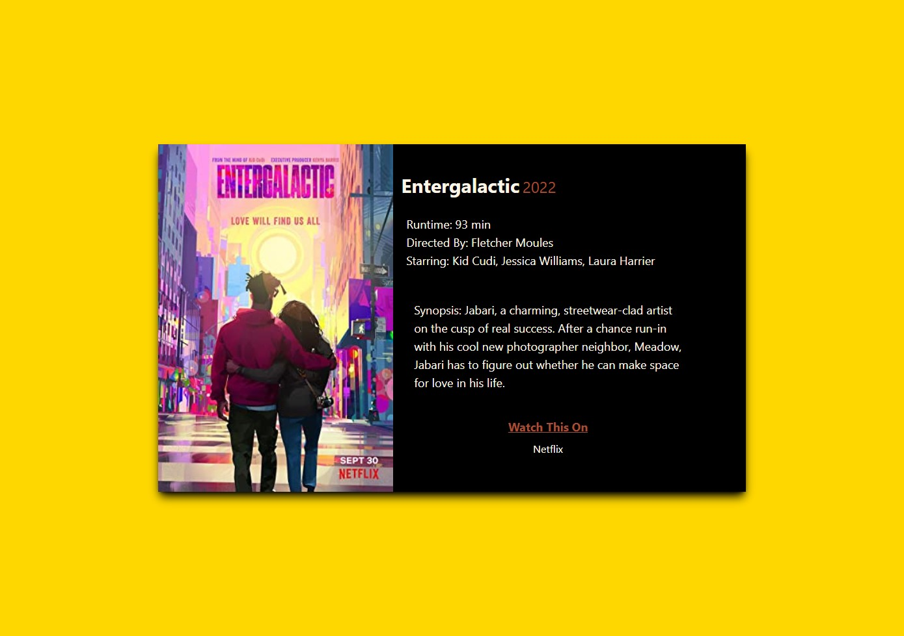

# Movie Match Maker

## Description

This is an application to select a movie for someone.The user inputs a movie genre and year range. Once the user presses the "Go" button, they are directed to a different page that loads their movie. A movie IMDB ID is generated by passing through the MoviesDatabase API, a randomly selected year from the year range and the selected genre. The ID is then passed through the MoviesDB API and the Streaming API to generate information. The information pulled is the movie poster, title, runtime, director(s), stars (or top actors), summary, and streaming options. This information is displayed on the page for the user.

## Usage

Webpage: https://adamhood15.github.io/restaurant-picker/

## Credits

CSS Framework: Tailwind 

APIs:
- MoviesDatabase: https://rapidapi.com/SAdrian/api/MoviesDatabase 
- MoviesDB: https://rapidapi.com/standingapi-standingapi-default/api/moviesdb5/ 
- Streaming Availability: https://rapidapi.com/movie-of-the-night-movie-of-the-night-default/api/streaming-availability 

## Future Development

- User can select multiple genres by using a swipe funtion (right for yes and left for no).
- User can swipe through movies if the selected is not a good fit.
- Movies liked are stored for the user to browse later.
- Streaming options are linked to their respective pages.

## Creators

Adam Hood, Claire Alverson, and Kyle Curry

## License

MIT License

